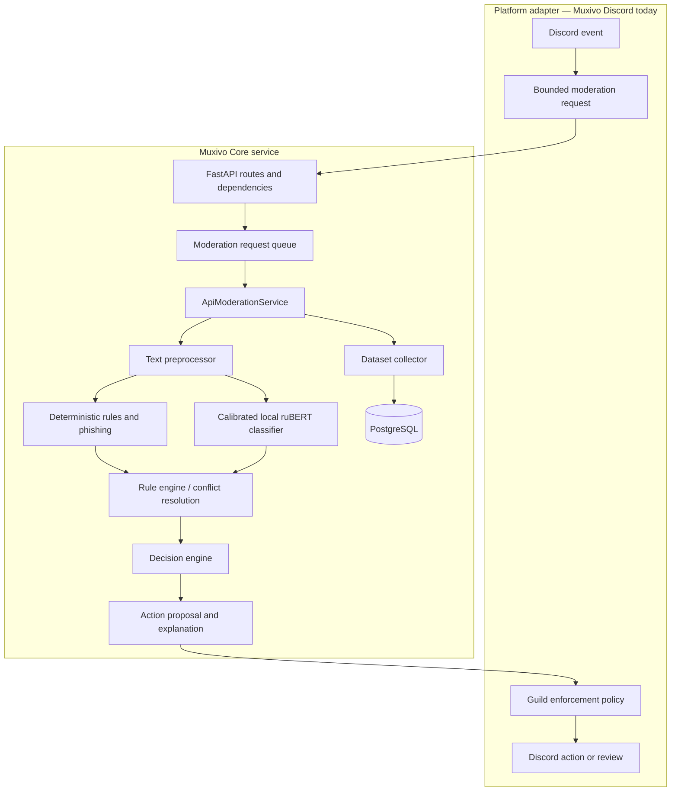

# Muxivo Core Architecture

## Purpose and boundaries

Muxivo Core converts a bounded platform-message request into an explainable moderation recommendation. It is not a Discord bot and never executes a Discord punishment. The platform adapter owns authentication to its platform, channel selection, human approval, and final enforcement.

## Code layout

| Area | Responsibility |
| --- | --- |
| `src/presentation/api/` | FastAPI factory, routers, typed dependencies, exception handling, health responses. |
| `src/application/` | Request orchestration, bounded queue, media orchestration, and application-level errors. |
| `src/modules/preprocessing/` | Normalization, contextual features, URL/invite/flood/evasion/profanity signals. |
| `src/modules/rules/` | Signal aggregation, risk breakdown, model agreement, and conflict resolution. |
| `src/modules/decision/` | Policy-driven action selection and explainable decision plans. |
| `src/modules/policy/` | Guild policy resolution and YAML fallback validation. |
| `src/modules/phishing/` | Optional domain-age and URL-reputation enrichment. |
| `src/modules/dataset/` | Sanitized decision collection for feedback, evaluation, and future training. |
| `src/infrastructure/` | PostgreSQL, settings, logging, HTTP/media/model provider implementations. |
| `src/domain/` and `src/contracts/` | Immutable DTOs, ports, policy types, and validation contracts. |
| `src/training/` and `scripts/training/` | Curation, dataset building, training, calibration, evaluation, and report generation. |

## Text request lifecycle

1. A router validates a bounded message contract, identifies the request, validates the internal key, and applies local rate limits.
2. `ModerationRequestQueue` bounds concurrent inference work.
3. `TextPreprocessor` produces normalized text and contextual features without making platform calls.
4. Deterministic preprocessing/rule policies, optional phishing results, and local ruBERT predictions are converted to compatible moderation signals.
5. The rule engine builds a risk score and resolves conflicts. `DecisionEngine` applies the effective guild policy and creates an action proposal with labels, reasons, evidence, and severity.
6. The decision is persisted through the dataset/event repositories before the response is returned. Feedback and action-result routes extend the same correlation lineage idempotently.

## Model release and readiness

The production release documented for 30 July 2026 is `rubert-tiny2-trained-20260730`, evaluated on a leakage-filtered 75,457-row holdout using calibrated per-label thresholds. The runtime loads exactly the directory supplied by `AI_MODERATOR_API_RUBERT_MODEL_DIR`; documentation does not override an operator's actual deployment configuration.

`GET /health` exposes the configured and ready state of the database, policy resolver, ruBERT, media, OCR, and image provider. If a component marked `*_REQUIRED=true` is unavailable, the overall health is degraded. A disabled optional component is reported as disabled rather than as a false success.

## Media lifecycle

`POST /moderation/media` handles the message and supported image attachments as one moderation decision.

1. The downloader accepts HTTPS only from the configured Discord CDN allowlist and validates every redirect destination.
2. It streams under strict file/request limits. The image validator checks decoded MIME, dimensions, pixel count, animation state, and decompression-bomb limits.
3. Hashing supports idempotency/cache lookup and optional known-scam exact SHA-256 or bounded pHash matching.
4. OCR and ONNX YOLO providers are independently enabled, required, ready, and versioned. Their outputs become signals; they never independently apply an action.
5. PostgreSQL stores limited metadata and versioned analysis results. Original bytes are not retained; redacted OCR material follows the configured retention period.

## Trust and safety model

- The API is intended for a private network and an internal API key, not direct public access.
- Model output is advisory. The adapter's policy enforcer remains the final safety boundary for destructive actions.
- Rules and policies are data-driven and versioned; a model label alone is not equivalent to a punishment.
- In Muxivo Discord, `SHADOW` produces a reviewable proposal only; `LIMITED` and `ELEVATED` constrain executable actions further.
- Logs and stored feedback must avoid full attachment bytes, temporary signed URLs, and unredacted OCR content.
